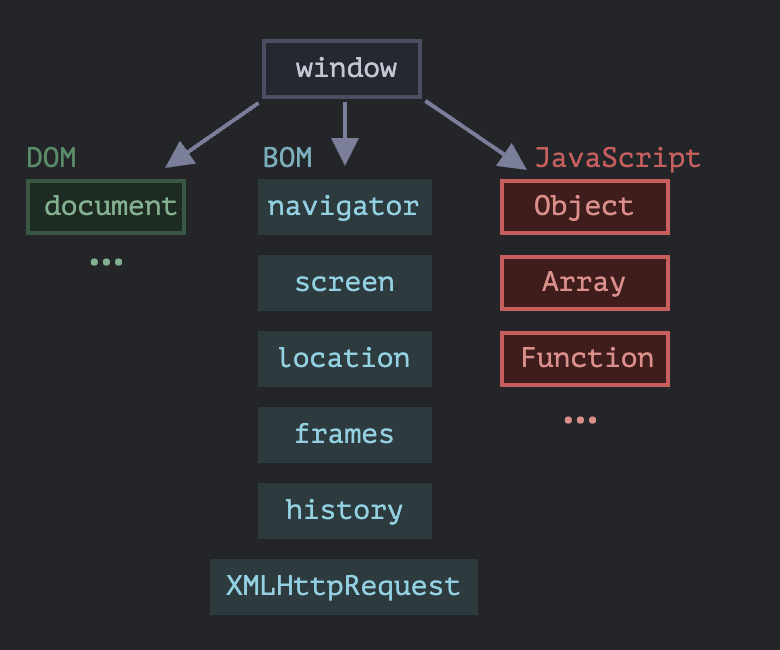

# Браузерное окружение, спецификации

Язык JavaScript изначально был создан для веб-браузеров, но с тех пор он эволюционировал и превратился в кроссплатформенный язык программирования.

Сегодня JS может использовать в разных средак. Каждая среда предоставляет свою функциональность, которую в спецификации называют окружением.

Окружение предоставляет свои объекты и дополнительные функции в дополнение базовым языком.

Как мы видим, имеется корневой объект window, который выступает в 2 ролях:

1. Во-первых, это глобальный объект для JavaScript-кода.
2. Во-вторых, он также представляет собой окно браузера и располагает методами для управления им.

## DOM (Document Object Model)

Document Object Model, сокращённо DOM – объектная модель документа, которая представляет все содержимое страницы в виде объектов, которые можно менять.

Объект `document` – основная «входная точка». С его помощью мы можем что-то создавать или менять на странице.

### DOM – не только для браузеров

Спецификация DOM описывает структуру документа и предоставляет объекты для манипуляций со страницей. Существуют и другие, отличные от браузеров, инструменты, использующие DOM.

Например, серверные скрипты, которые загружают и обрабатывают HTML-страницы, также могут использовать DOM. При этом они могут поддерживать спецификацию не полностью.

### CSSOM для стилей

Правила стилей CSS структурированы иначе чем HTML. Для них есть отдельная спецификация CSSOM, которая объясняет, как стили должны представляться в виде объектов, как их читать и писать.

CSSOM используется вместе с DOM при изменении стилей документа. В реальности CSSOM требуется редко, обычно правила CSS статичны. Мы редко добавляем/удаляем стили из JavaScript, но и это возможно.

## BOM (Browser Object Model)

Объектная модель браузера (Browser Object Model, BOM) – это дополнительные объекты, предоставляемые браузером (окружением), чтобы работать со всем, кроме документа.